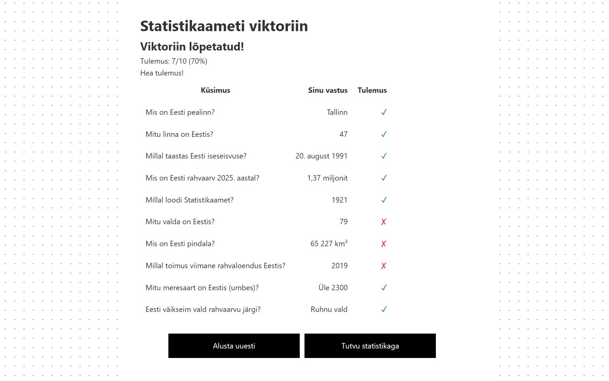

# Statistikaameti Viktoriin

Viktoriin Eesti kohta.



## Live

[https://uvemae.github.io/stat-quiz-app/](https://uvemae.github.io/stat-quiz-app/)

## Tehnoloogiad

- React 18
- TypeScript
- Vite
- Playwright
- GitHub Pages

## Paigaldamine ja käivitamine

```bash
# Klooni repositoorium
git clone https://github.com/UveEllermae/stat-quiz-app.git
cd stat-quiz-app

# Installi sõltuvused
npm install

# Käivita arendusserver
npm start

# Ehita production build
npm run build

# Jooksuta teste
npm test
```

## Funktsionaalsus

- 10 küsimust Eesti ja Statistikaameti kohta
- Tulemuste tabel vastustega
- Personaalne sõnum
- Statistikaameti disain
- Testimine Playwright'iga

## Autor

**Uve Ellermäe**
